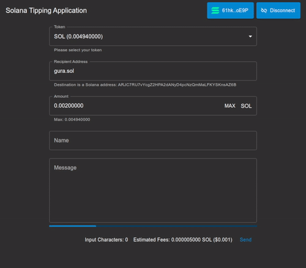

<h1 align="center">Soltip</h1>

<div align="center">
A tipping DApp for Solana and OBS Studio users.
</div>

## Quick Links
- [Introduction](#introduction)
- [Feature](#feature)
- [Demo](#demo)
- [Build And Setup](#build-and-setup)
    + [Build from Source](#build-from-source)
    + [Setup](#setup)
- [Credits](#credits)

## Introduction
Solana's first tipping app, SolTip, is a frontend only tipping solution with real-time prices using Pyth API. SolTip provides streamers with an alert box for every donation, allowing for immediate audience engagement. Featuring extremely low transaction fees second only to IOTA, SolTip is fast, accurate, and easy to use.

## Feature
- Customized accepted minimal price 
- Customized token watch list
- Bad-words Filter
- Support SNS Domain (`.sol`)

## Demo
1. Setting up CLR Browser for OBS. The link is `https://soltip.tw/alertbox/?address=ADDRESS`. Replace `ADDRESS` with your SOL address or domain name. For example:
```
https://soltip.tw/alertbox/?address=gura.sol
```
Or
```
https://soltip.tw/alertbox/?address=ARJC7RU7vYcgZ2HPA2dANyD4pcNzQmMaLFKYSKnsAZ6B&imgurl=https://i.imgur.com/tsvPcg8.gif
```

### Query Parameters
Name|Required|Description
-|-|-
address|O|Address of receiver. Can be SOL address or domain name.
imgurl||Url of image.


2. Tipping someone. Open 
```
https://soltip.tw/tip
```
Or
```
https://soltip.tw/tip?address=ADDRESS
```
and connect with your wallet, try to send any token with a message. Only the tip with a price above the threshold and accepted tokens will display on alert-box page. The minimal accepted price is **$0.1** and these accepted tokens are **SOL, USDC, RAY** by default.

3. Wait for 10s to see the result. If not, one of the reasons is that the RPC endpoint (`mainnet-beta`) rejects your request, you should try to build by yourself and then increase `POLLING_INTERVAL`.

<p align="center">
  </p>
</p>

## Build And Setup

### Build from Source

1. Clone the project:
```shell
git clone https://github.com/7h2x5e/soltip.git
```

2. Install dependencies:
- For alert box
    ```
    cd packages/alert-box/ && yarn
    ```
- For tipping page
    ```
    cd packages/tip/ && yarn
    ```

3. Build:
```shell
yarn build
```

4. Run locally:
```shell
yarn start
```

### Setup

In `package/alert-box/src/config.js`:
```tsx
export const POLLING_INTERVAL = 10000;
export const PRICE_POLLING_INTERVAL = 30000;
export const ALERT_BOX_DELAY = 8000;
export const ALERT_BOX_INTERVAL = 1000;
export const MINIMAL_ACCEPTED_PRICE_IN_USD = 0.03; // 0 = unlimited
export const ORACLE_MAPPING_PUBLIC_KEY = 'AHtgzX45WTKfkPG53L6WYhGEXwQkN1BVknET3sVsLL8J'; // For mainnet-beta
export const ANIME_GIF_LOCATION = './gura.gif'
export const ENABLE_BAD_WORDS_FILTER = true;

// [ token mint address, price account key ]
export const SOL_PRICE_ACCOUNT_KEY = "H6ARHf6YXhGYeQfUzQNGk6rDNnLBQKrenN712K4AQJEG";
export const WATCH_LIST = [ 
    // USDC 
    ["EPjFWdd5AufqSSqeM2qN1xzybapC8G4wEGGkZwyTDt1v", "Gnt27xtC473ZT2Mw5u8wZ68Z3gULkSTb5DuxJy7eJotD"],
    // RAY
    ["4k3Dyjzvzp8eMZWUXbBCjEvwSkkk59S5iCNLY3QrkX6R", "AnLf8tVYCM816gmBjiy8n53eXKKEDydT5piYjjQDPgTB"]
]

export const CUSTOM_BAD_WORDS = [
    "BTC"
]
```

- Token mint address can be retrieved from [spl-token-wallet](https://github.com/project-serum/spl-token-wallet/blob/f30c9eeb689de0a2cb7b76089f5d5d53f8263a5b/src/utils/tokens/names.js).
- Price account key can be retrieved from [pyth](https://pyth.network/developers/accounts/).

For example, to accept FTT tips:

```tsx
export const WATCH_LIST = [
    ...,
    [
        // FTT
        "AGFEad2et2ZJif9jaGpdMixQqvW5i81aBdvKe7PHNfz3",
        "8JPJJkmDScpcNmBRKGZuPuG2GYAveQgP3t5gFuMymwvF"
    ]
]
```

## Credits
Technical Support: @wei


1y VPS support: @Seamus


